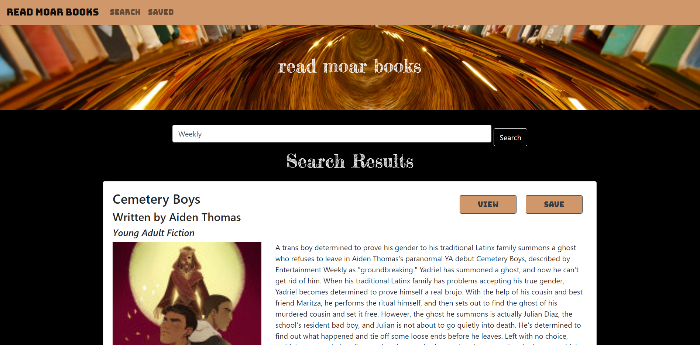

# Read Moar Books 

    
### Deployed Application: [Read Moar Books](https://read-moar-books.herokuapp.com/)

## Description
This is a simple MERN application that allows users to search and save their favorite books using Google Books.

### Demo 
*Demo to come!*

### Technologies Used
- MongoDB
- Express
- React
- Node
- Heroku
- React-Bootstrap
- Dotenv

#### License
This project is licensed under MIT. 

#### Questions
    
If you have any questions, please [email me.](mailto:aiden.threadgoode@gmail.com)

If you'd like to see more of my work, feel free to check out [my github!](https://github.com/a-thread)

*© 2020 Aiden Threadgoode*
    
